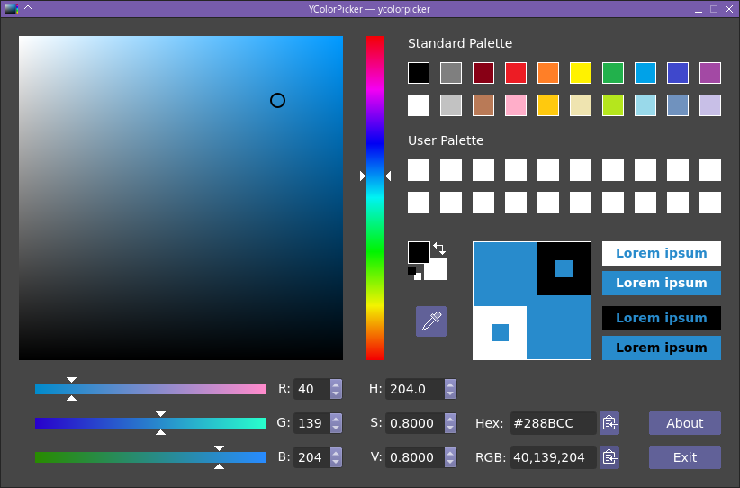

YColorPicker
============

YColorPicker is a neat looking color picker program written in C++ using the Qt GUI toolkit. It lets you choose a color by adjusting red/green/blue or hue/saturation/value components numerically and visually, and displays the color value in "r,g,b" and CSS hexadecimal (`#RRGGBB`) formats for easy copy and paste. It has a fixed standard palette and a user-editable palette which is saved between sessions. The current color is displayed next to selectable foreground and background colors to help determine contrast, legibility, etc. It even lets you sample a pixel from somewhere on your screen.




Requirements
------------

To build YColorPicker, you will need to install Git (optional), Qt >= 5.11.0, CMake and a C++ compiler. On Debian/Ubuntu you can do this with the command:

```sh
  sudo apt install build-essential git cmake qtbase5-dev
```


Get the Source Code
-------------------

Now download the source code with Git:

```sh
  git clone https://github.com/ieyasu/ycolorpicker-qt5.git
```

Alternatively, open https://github.com/ieyasu/ycolorpicker-qt5 and use another GitHub method such as downloading a ZIP archive of the source.


Compiling
---------

Once you have the source code, go to that directory and run the following commands in a terminal:

```sh
  mkdir build
  cd build
  cmake ..
  make
```

Instead of `cmake ..` you may wish to set certain options such as the install location (the default is usually /usr/local), e.g.:

```sh
  cmake .. -DCMAKE_INSTALL_PREFIX=$HOME/.local
```

or use a different compiler, e.g.

```sh
  cmake .. -DCMAKE_CXX_COMPILER=clang++
```


Installation
------------

If everything compiles cleanly you can install the program with

```sh
  sudo make install
```


License
-------

This program is free software: you can redistribute it and/or modify it under the terms of the GNU General Public License as published by the Free Software Foundation, either version 3 of the License, or (at your option) any later version.

This program is distributed in the hope that it will be useful, but WITHOUT ANY WARRANTY; without even the implied warranty of MERCHANTABILITY or FITNESS FOR A PARTICULAR PURPOSE.  See the GNU General Public License for more details.

You should have received a copy of the GNU General Public License along with this program.  If not, see https://www.gnu.org/licenses/
